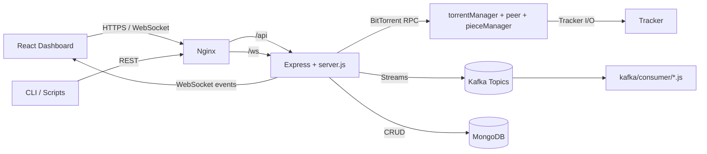
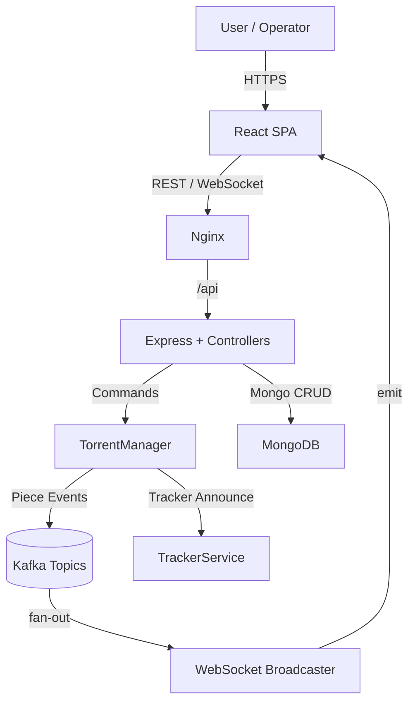
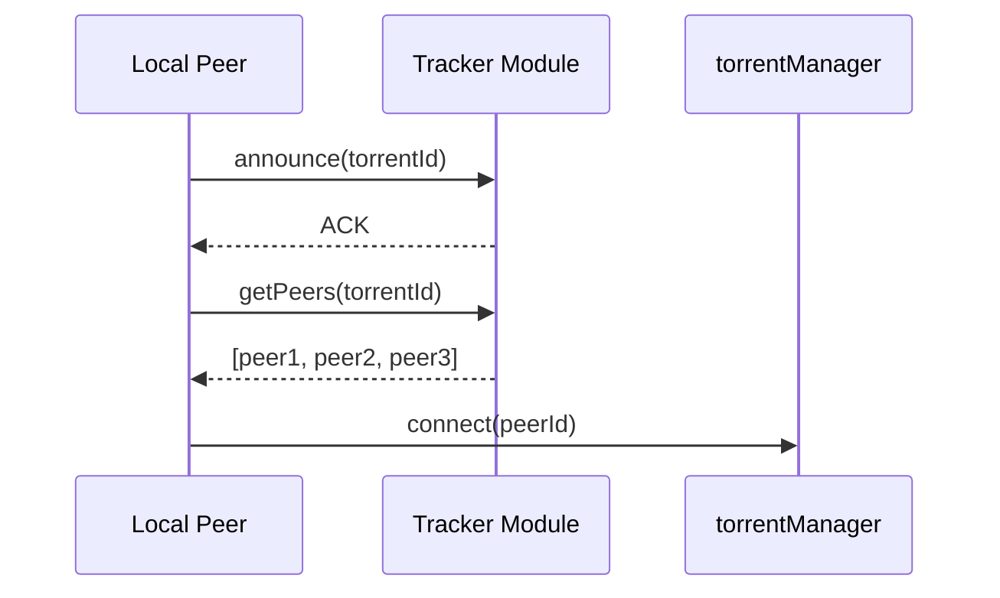
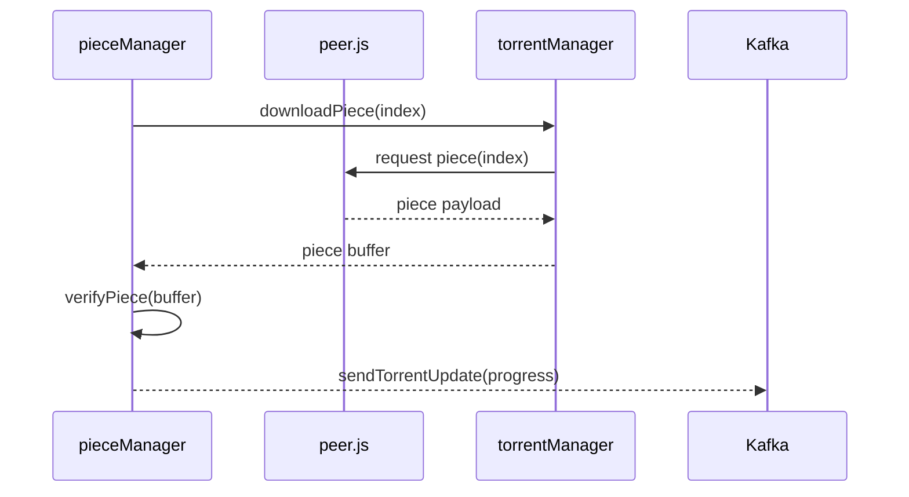
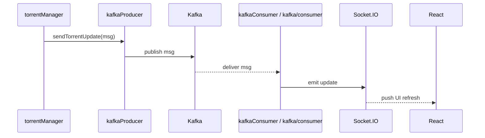

# TorrentEdge

TorrentEdge is a distributed BitTorrent client and observability stack that couples a Node.js engine (`src/client`) with an event-driven control plane (Kafka), an HTTPS/WebSocket API (`src/server`), and a React dashboard (`web/web-react-new`). This document explains how the pieces fit together so the system can be deployed, extended, and operated in production.

## Executive Overview

TorrentEdge combines BitTorrent primitives (torrent creation, peer discovery, piece exchange) with real-time monitoring. Kafka-backed producers/consumers broadcast every material event so the API tier, WebSocket clients, and the React dashboard all see consistent state. Nginx provides TLS termination, caching, and request routing, while Docker Compose packages the entire topology (Kafka, Zookeeper, MongoDB, Node.js backend, React frontend, Nginx) for reproducible deployments.

## Core Capabilities

- Peer-to-peer orchestration through `torrentManager`, `peer`, `tracker`, and `pieceManager` modules.
- Event streaming via `src/client/kafkaProducer.js`, `src/client/kafkaConsumer.js`, and the specialized scripts under `kafka/producer` and `kafka/consumer`.
- REST + WebSocket API exposing torrent lifecycle, authentication, health, statistics, and chat endpoints inside `src/server`.
- React dashboard (`web/web-react-new`) for user workflows such as torrent CRUD, monitoring, chat, and notifications.
- Nginx reverse proxy (`nginx/default.conf`) handling `/`, `/api`, and `/ws` routing plus static asset delivery.
- End-to-end containerization in `docker-compose.yml`, including Zookeeper/Kafka, MongoDB persistence, backend, frontend build, and edge proxy.
- Automated regression tests in `tests/torrent.test.js` demonstrating deterministic torrent operations.

## System Architecture

The workspace is segmented for clear ownership:

- `src/client`: BitTorrent primitives plus Kafka adapters.
- `src/api`: Light-weight routers (for example `torrent.Controller.js`) that map HTTP routes to client logic.
- `src/server`: Express server (`server.js`), Socket.IO glue (`socket.js`), controllers, routes, middleware, and models backed by MongoDB.
- `kafka/`: Topic definitions (`topics/topicConfig.json` + `createTopics.js`) and standalone producers/consumers built with `kafkajs` for operational tooling.
- `nginx/`: Reverse proxy contract between the public edge and the internal containers.
- `web/web-react-new`: React 18 application with reusable components (Dashboard, TorrentList, Statistics, Chat, etc.), ErrorBoundary, and API adapters.
- `tests/`: Node-based test suites that exercise torrent workflows without spinning up the full stack.

## High-Level Design

At a glance, TorrentEdge routes external traffic through Nginx, terminates into Express/Socket.IO, orchestrates torrent jobs within the Node.js engine, persists metadata in MongoDB, and emits/consumes Kafka events for cross-service synchronization.



## Low-Level Design

- **HTTP / WebSocket layer**: `src/server/server.js` mounts all routes, wires Socket.IO, and centralizes logging (Winston + Morgan). Middlewares enforce CORS, JSON parsing, and error trapping.
- **API controllers**: Auth, user, torrent, statistics, and health controllers live in `src/server/controllers` and encapsulate business policies before passing work to the BitTorrent engine or persistence layer.
- **Torrent engine**: The composable modules in `src/client` provide single-responsibility entry points for torrent creation, peer coordination, tracker communication, and piece integrity checks.
- **Kafka bridge**: `src/api/kafkaController.js` uses `kafka-node` for lightweight publish/subscribe from the API tier, while the ops scripts under `kafka/` rely on `kafkajs` for administrative convenience (topic creation, background consumers).
- **Frontend**: The React workspace stitches together API wrappers (`web/web-react-new/src/api/*.js`), global styles, and feature components (Dashboard, TorrentList, TorrentDetail, Notifications, Chat) behind `Router.js`.
- **Infrastructure**: `docker-compose.yml` orchestrates infrastructure-grade services (Kafka, Zookeeper, MongoDB) alongside application containers (backend, frontend build stage, Nginx). The backend build context inherits from `src/server/Dockerfile`; the frontend build is defined in `web/web-react-new/Dockerfile`.

## Detailed Module Explanations

### torrentManager (`src/client/torrentManager.js`)

Central orchestration point for torrent lifecycles. `create(file)` allocates metadata for new torrents, while `track(torrentId)` samples download progress. Today the module logs and returns fixture data, but the interface is purpose-built for plugging in a full BitTorrent implementation (piece selection, DHT, upload slots). Tests reference the contract directly (`tests/torrent.test.js`).

### peer (`src/client/peer.js`)

Encapsulates peer connectivity. `connect(peerId)` abstracts the handshake (TCP/WebRTC depending on future transport), and `sendPiece(peerId, piece)` is the gateway for uploading validated pieces. Each method currently instruments console logs so event hooks can be added rapidly.

### tracker (`src/client/tracker.js`)

Owns tracker communication. `announce(torrentId)` propagates presence, and `getPeers(torrentId)` returns candidate peers. The stub returns deterministic peer IDs, which enables integration tests without depending on a live tracker.

### pieceManager (`src/client/pieceManager.js`)

Manages individual piece operations. `downloadPiece(index)` and `verifyPiece(piece)` isolate networking concerns from integrity checks (hash validation, retransmission policy). This isolation makes it trivial to parallelize download workers later while keeping validation logic centralized.

### kafkaProducer (`src/client/kafkaProducer.js`)

Thin façade over `src/api/kafkaController.js`. `sendTorrentUpdate(message)` publishes progress, tracker data, or anomaly reports to the `torrent-updates` topic so downstream consumers (WebSocket relay, analytics jobs, alerting) stay synchronized.

### kafkaConsumer (`src/client/kafkaConsumer.js`)

Attaches to `torrent-updates` via `kafkaController.consumeMessage` and streams events into the console for now. Hooks can be added to push updates into Socket.IO rooms or persist checkpoint data. The consumer is intentionally tiny so multiple instances can run inside workers without extra ceremony.

### API Controllers (`src/api/torrent.Controller.js`, `src/api/kafkaController.js`, `src/server/controllers/*.js`)

`torrent.Controller.js` registers Express routes for torrent creation and tracking, validates inputs, and delegates to `torrentManager`. `kafkaController.js` initializes a `kafka-node` client/producer/consumer pair for intra-service messaging. Under `src/server/controllers/`, dedicated controllers implement authentication (`authController.js`), user profile management (`userController.js`), and torrent persistence (`torrentController.js`, backed by `src/server/models/torrent.js`). These controllers enforce HTTP semantics (status codes, error payloads) before communicating with MongoDB or the BitTorrent engine.

### server.js (`src/server/server.js`)

Composes the HTTP, WebSocket, logging, and routing stack. Key excerpt:

```javascript
// src/server/server.js
const server = http.createServer(app);
const io = socketIO(server);

app.use('/api/auth', authRoutes);
app.use('/api/torrent', torrentRoutes);

io.on('connection', (socket) => {
  logger.info('New client connected');
  socket.on('disconnect', () => {
        logger.info('Client disconnected');
  });
});
```

The server enforces CORS, ships logs via Winston, exposes health checks (`/api/health`), and binds to `process.env.PORT` (default `3029`, mapped to `3000` in Docker).

### Nginx (`nginx/default.conf`)

Acts as the single ingress. Static assets are served from `/usr/share/nginx/html` (the React build), while `/api` traffic is proxied to `backend:3000/api/` with WebSocket upgrade headers. `/ws` isolates Socket.IO upgrades so browsers maintain long-lived connections without hitting the REST pool. The same config works locally via Compose and in production with minor hostname tweaks.

### React Frontend (`web/web-react-new/src`)

Built with React 18 + React Router. `Router.js` stitches routes for Dashboard, TorrentDetail, TorrentList, Notifications, Chat, Login/Register, etc. Each feature owns its component tree plus styles under `styles/`. API wrappers (`src/api/api.js`, `auth.js`, `statistics.js`, `user.js`) centralize axios/fetch calls so environment-specific base URLs propagate through `REACT_APP_API_BASE_URL`. Error boundaries, global logging (`loggingService.js`), and web-vitals instrumentation ship by default. The Dockerfile builds static assets that Nginx serves.

## Data Flow Diagram



## Sequence Diagrams

### Peer Discovery



### Piece Request / Response Cycle



### Kafka Event Propagation



## Deployment Architecture (Docker + Nginx + Node.js + Kafka)

`docker-compose.yml` defines the production topology:

- **Kafka stack**: `zookeeper` + `kafka` containers on `kafka-network`, exposing `9092` for internal brokers.
- **Application network**: `backend` (Node.js Express from `src/server/Dockerfile`), `frontend` (React build stage), and `nginx` (serving the build + proxying `/api` and `/ws`) share `app-network` for low-latency hops.
- **Persistence**: `mongodb` container with seeded credentials and a `mongo-data` volume.
- **Health**: Backend health-check hits `/api/health`; Nginx waits on backend/frontend before serving traffic.

For topic bootstrapping, run `node kafka/topics/createTopics.js` once the broker is reachable. Custom producers (`kafka/producer/*.js`) and consumers (`kafka/consumer/*.js`) can be launched inside or outside Docker for diagnostics.

## Testing

Unit tests sit under `tests/`. Example:

```javascript
// tests/torrent.test.js
it('should create a torrent', () => {
  const file = { name: 'testfile.txt', size: 1024 };
  const torrent = torrentManager.create(file);
  assert.strictEqual(torrent.status, 'created');
});
```

Run with `npm test` (backend package.json) or integrate into CI to catch regressions in module contracts.

## Performance Considerations

- **Kafka throughput**: Partition `torrent-updates` and `peer-topic` based on swarm size. Increase `numPartitions` in `kafka/topics/topicConfig.json` and rebalance consumer groups.
- **Connection pooling**: Replace per-call connects in `kafka/producer/*.js` with long-lived producers for high-volume deployments.
- **WebSocket broadcasting**: Use namespaces/rooms in `socket.js` to avoid sending every event to every client.
- **Static asset caching**: Extend Nginx config with cache headers and compression for `static/js` bundles generated by the React build.
- **MongoDB indexes**: Add indexes on torrent hash, user ID, and createdAt in `src/server/models` to accelerate queries from controllers.

## Fault Tolerance and Recovery Paths

- **Kafka resilience**: Deploy brokers in a cluster; raise `replicationFactor` in `topicConfig.json` to avoid data loss. Consumers auto-commit offsets; wrap with retry/backoff logic before acting on events.
- **Tracker/peer failures**: `tracker.getPeers` already tolerates empty responses; add retry loops plus exponential backoff inside `torrentManager` to rehydrate peers.
- **API resilience**: Winston captures structured logs; hook them into centralized logging (ELK, Loki) for alerting. Use the health route for liveness probes and restart containers via Compose or orchestration when they fail.
- **Frontend resilience**: `ErrorBoundary.js` prevents UI-wide crashes and surfaces actionable errors to operators.

## Security Model

- **Authentication**: `src/server/controllers/authController.js` issues JWTs signed with `process.env.JWT_SECRET`. Apply `authMiddleware` to protect torrent/user routes.
- **Transport security**: Terminate TLS at Nginx; forward sanitized proxied headers to the backend. Enforce `proxy_set_header Host` and `Upgrade` semantics already present in `nginx/default.conf`.
- **Secrets management**: `.env` feeds the backend container; use Docker secrets or orchestration-level secret stores in production.
- **Input validation**: Controllers validate payloads (e.g., `torrent.Controller.js` ensures `file` is provided). Expand with schema validation to block malformed data before it reaches the engine.

## Scaling Strategy

- **Horizontal backend scaling**: Run multiple backend containers behind Nginx and configure sticky sessions for WebSockets or adopt Socket.IO adapters (Redis) for broadcast consistency.
- **Kafka scaling**: Increase partitions and run additional consumer groups for analytics vs. real-time notifications.
- **BitTorrent workers**: Containerize dedicated piece workers that import `torrentManager`, subscribe to Kafka commands, and offload CPU-intensive hashing from the API node.
- **Frontend distribution**: Deploy the `web-react-new` build to a CDN while Nginx continues to proxy authenticated API/WebSocket requests.

## Future Roadmap

1. **Full BitTorrent protocol support**: Implement choke/unchoke, rarest-first, DHT, and encryption in the `src/client` modules.
2. **Observability**: Instrument Kafka lag metrics, Socket.IO throughput, and torrent-level KPIs (availability, swarm size) for Grafana dashboards.
3. **Role-based access control**: Extend the auth stack with roles/scopes enforced inside `authMiddleware` and the React router.
4. **Automated scaling**: Provide Helm charts or Terraform modules that mirror the Compose topology with production-grade networking and monitoring.
5. **Advanced recovery**: Add checkpointing in MongoDB for partially downloaded torrents, enabling restart-from-checkpoint semantics after crashes.

TorrentEdge is engineered for clarity and extensibility—use this README as the contract for future enhancements.
