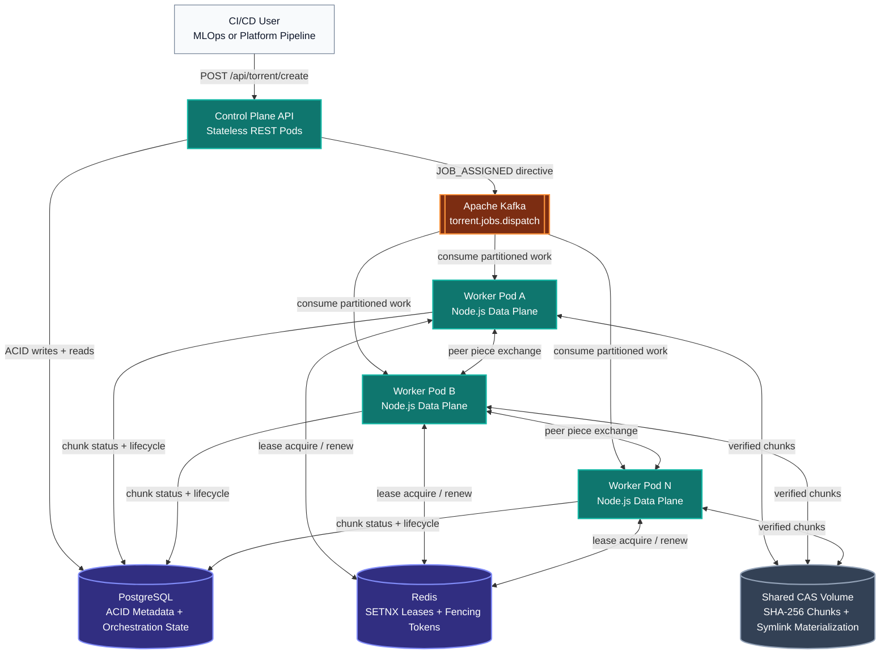

<div align="center">

# ⚡ TorrentEdge

**Cloud-Native, Peer-Assisted Artifact Distribution for GPU Fleets, MLOps Pipelines, and Platform Infrastructure**


</div>

> **Stop paying AWS to transfer the same 70GB model 50 times. TorrentEdge pulls trusted bytes once, verifies them chunk by chunk, and fans them out across your VPC over peer-assisted East-West paths.**

TorrentEdge is a cloud-native artifact router for infrastructure teams that move very large binary assets: model checkpoints, dataset shards, build artifacts, VM images, and other deployment-critical payloads. It is designed for the moment when centralized object storage becomes a fleet-wide bottleneck and every node in the cluster starts competing for the same North-South bandwidth.

## 🚨 The "Thundering Herd" Problem

- 🔥 **Top-of-Rack collapse:** A 50+ node GPU fleet pulling the same 70GB artifact at once can saturate VPC endpoints, NAT gateways, and ToR uplinks before the workload even starts.
- 💸 **Egress amplification:** One rollout becomes dozens of redundant object-store reads, multiplying cloud transfer costs for bytes that are identical across the fleet.
- 🕒 **Tail-latency rollouts:** Nodes finish at different times based on network contention, so inference, fine-tuning, or batch jobs wait for the slowest artifact pull.

## 🧠 Architecture & Core Engine

- 🧱 **Control Plane:** A stateless REST API owns orchestration, request correlation, access control boundaries, and transfer lifecycle commands. PostgreSQL is the strict source of truth for ACID-compliant metadata, chunk state, and job coordination.
- ⚙️ **Data Plane:** Horizontally scalable Node.js worker daemons consume directives, verify pieces, execute peer protocols, and write artifact data. Workers are crash-only by design: they can be preempted, restarted, or OOM-killed without corrupting committed state.
- 🧬 **Content-Addressable Storage:** Verified chunks are stored by digest and materialized through local symlinks, allowing workers to deduplicate identical data across transfers and avoid redundant disk I/O.
- 🔐 **Distributed Leases:** Redis `SETNX` locks and fencing tokens coordinate shared storage access, prevent split-brain writes, and let replacement workers safely resume abandoned transfers.
- 📨 **Event Bus:** Apache Kafka decouples API-facing orchestration from worker execution through asynchronous job dispatch, lifecycle events, and telemetry streams.

## 🗺️ Deployment Topology


```mermaid
graph TD
  CICD[CI/CD User<br/>MLOps or Platform Pipeline]:::actor
  API[Control Plane API<br/>Stateless REST Pods]:::compute
  PG[(PostgreSQL<br/>ACID Metadata + Orchestration State)]:::database
  KAFKA[[Apache Kafka<br/>torrent.jobs.dispatch]]:::event
  REDIS[(Redis<br/>SETNX Leases + Fencing Tokens)]:::database
  W1[Worker Pod A<br/>Node.js Data Plane]:::compute
  W2[Worker Pod B<br/>Node.js Data Plane]:::compute
  WN[Worker Pod N<br/>Node.js Data Plane]:::compute
  CAS[(Shared CAS Volume<br/>SHA-256 Chunks + Symlink Materialization)]:::storage

  CICD -->|POST /api/torrent/create| API
  API -->|ACID writes + reads| PG
  API -->|JOB_ASSIGNED directive| KAFKA
  KAFKA -->|consume partitioned work| W1
  KAFKA -->|consume partitioned work| W2
  KAFKA -->|consume partitioned work| WN
  W1 <-->|peer piece exchange| W2
  W2 <-->|peer piece exchange| WN
  W1 <-->|lease acquire / renew| REDIS
  W2 <-->|lease acquire / renew| REDIS
  WN <-->|lease acquire / renew| REDIS
  W1 <-->|verified chunks| CAS
  W2 <-->|verified chunks| CAS
  WN <-->|verified chunks| CAS
  W1 -->|chunk status + lifecycle| PG
  W2 -->|chunk status + lifecycle| PG
  WN -->|chunk status + lifecycle| PG

  classDef actor fill:#f8fafc,stroke:#64748b,color:#0f172a,stroke-width:1px;
  classDef compute fill:#0f766e,stroke:#14b8a6,color:#ffffff,stroke-width:2px;
  classDef database fill:#312e81,stroke:#818cf8,color:#ffffff,stroke-width:2px;
  classDef event fill:#7c2d12,stroke:#fb923c,color:#ffffff,stroke-width:2px;
  classDef storage fill:#334155,stroke:#94a3b8,color:#ffffff,stroke-width:2px;
```

## ⚡ Quick Start (Evaluation Mode)

```bash
git clone https://github.com/techmedaddy/TorrentEdge.git
cd TorrentEdge
cp .env.example .env
docker compose up -d
```

- 🚀 **Local cluster:** Boots the API, PostgreSQL, Kafka, Redis, worker runtime, and telemetry pipeline for evaluation.
- 🩺 **Health check:** `GET http://localhost:3029/api/health` confirms the API process is live.
- 📊 **Metrics endpoint:** `GET http://localhost:3029/metrics` exposes Prometheus-compatible service and transfer metrics.

## 🧪 Code Review (SonarCloud)

SonarCloud is a lightweight, hosted alternative to running SonarQube locally.

### ✅ Create a Project & Token

1. Create a project in SonarCloud.
2. Generate a project token for analysis.

### ✅ Run a Scan (Locally)

```bash
SONAR_TOKEN=<YOUR_TOKEN> npx sonar-scanner
```

The scan configuration lives in [sonar-project.properties](sonar-project.properties).

## 🔌 API & Pipeline Integration

```bash
curl -X POST http://localhost:3029/api/torrent/create \
  -H "Authorization: Bearer $TORRENTEDGE_TOKEN" \
  -H "X-Request-ID: model-rollout-2026-05-24-001" \
  -H "Content-Type: application/json" \
  -d '{
    "magnetURI": "magnet:?xt=urn:btih:0123456789abcdef0123456789abcdef01234567&dn=llama3-70b-checkpoint.safetensors",
    "autoStart": true
  }'
```

- 🧾 **Idempotency by design:** `X-Request-ID` is propagated through the Control Plane and Kafka directive metadata so CI/CD retries can be correlated and guarded against duplicate work.
- 🧭 **Pipeline-native dispatch:** The API returns transfer metadata while workers asynchronously acquire leases, discover peers, verify chunks, and publish lifecycle state.
- 🔁 **Retry-safe operations:** Reusing the same request ID lets infrastructure automation distinguish a retry from a new deployment intent.

## 📡 Telemetry & Observability

- 📈 **Prometheus metrics:** TorrentEdge exports API latency, Kafka throughput, queue depth, worker heartbeats, lease activity, CAS hit rate, and deduplicated bytes.
- 🔭 **OpenTelemetry distributed tracing:** Request IDs and W3C trace context flow from REST ingress through Kafka dispatch into worker execution and CAS writes.
- 🛰️ **WebSocket streams for SREs:** Real-time transfer progress, peer counts, throughput, and piece completion events can be streamed into operational tooling.

## 🧭 Roadmap

- [x] ✅ **Phase 1:** Control Plane hardening, PostgreSQL-backed orchestration state, request correlation, and Prometheus metrics.
- [x] ✅ **Phase 2:** Kafka directive bus, Node.js worker execution path, Redis leases, fencing tokens, and CAS-aware piece verification.
- [ ] 🧰 **Phase 3:** Production Helm charts and Terraform modules for repeatable Kubernetes and cloud-network deployment.
- [ ] ❄️ **Phase 4:** S3 Cold Start Bridge for first-seed range streaming, peer bootstrap, and object-store egress minimization.

## 🤝 License

- 📜 **MIT:** TorrentEdge is released under the MIT License for infrastructure teams that need inspectable, adaptable artifact distribution primitives.
