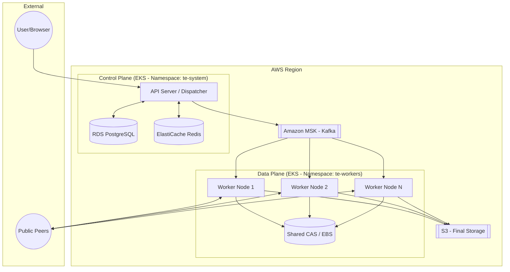
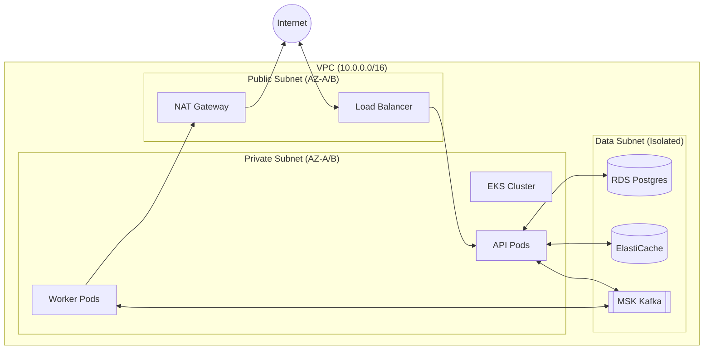

# 🚀 TorrentEdge: AWS Production Deployment Plan

This document outlines the blueprint for deploying TorrentEdge as a highly-available, distributed system on AWS.

## 🏗️ 1. High-Level Architecture (Logical)

The system is split into a **Control Plane** (Management) and a **Data Plane** (Execution), decoupled by **Amazon MSK (Kafka)**.

---

## 🌐 2. Network Topology (VPC)

To minimize latency and maximize security, we use a multi-AZ VPC.

*   **Public Subnets**: Application Load Balancer (ALB) and NAT Gateways.
*   **Private Subnets**: EKS Worker Nodes (API & Workers).
*   **Isolated Subnets**: Databases (RDS, ElastiCache, MSK).

---

## 🛠️ 3. AWS Service Selection

| Component | AWS Service | Rationale |
| :--- | :--- | :--- |
| **Orchestration** | **Amazon EKS** | Managed K8s for self-healing and scaling. |
| **Event Bus** | **Amazon MSK** | Managed Kafka handles high-throughput job dispatch. |
| **Relational DB** | **RDS PostgreSQL** | Multi-AZ for high availability of metadata. |
| **Cache/Leases** | **ElastiCache Redis** | Critical for sub-millisecond lease management. |
| **Hot Storage** | **EBS (gp3)** | High IOPS for BitTorrent piece writing. |
| **Cold Storage** | **Amazon S3** | Durable, low-cost long-term storage for completed files. |
| **Monitoring** | **Managed Prometheus** | Managed ingestion of our existing metrics. |

---

## ⚡ 4. Data Flow: From Magnet to Disk

1.  **Ingest**: User submits a Magnet URI to the **API**.
2.  **Dispatch**: API generates a `JOB_ASSIGNED` directive and publishes it to **MSK**.
3.  **Execution**: An available **Worker** consumes the job and checks **Redis** for the lease.
4.  **Deduplication**: Worker checks the **CAS (EBS)** for existing chunks before downloading.
5.  **Replication**: Node uses **Internal Peer Discovery** to find sibling nodes in the VPC for fast, free data transfer.
6.  **Finalize**: Once 100% complete, the Worker moves the file from **EBS** to **S3** and updates **PostgreSQL**.

---

## 💰 5. Cost & Performance Optimization

*   **VPC Peering**: By using our **Internal Peer Discovery**, nodes talk over the private AWS backbone. Data transfer between instances in the same AZ is **$0/GB**, significantly reducing egress costs.
*   **EKS Spot Instances**: Worker nodes are stateless (state is in EBS/RDS). We can use **EC2 Spot Instances** for workers to reduce compute costs by up to **90%**.
*   **EBS gp3**: We will use `gp3` volumes with provisioned throughput to ensure consistent performance during heavy BitTorrent DHT lookups.

---

## 📈 6. Deployment Phases

1.  **Phase 5.1 (Terraform)**: Provision VPC, MSK, RDS, and EKS.
2.  **Phase 5.2 (Secrets)**: Integrate AWS Secrets Manager with EKS using External Secrets Operator.
3.  **Phase 5.3 (Helm)**: Deploy API, Workers, and Grafana using Helm charts.
4.  **Phase 5.4 (CI/CD)**: Set up GitHub Actions for automated Docker builds and EKS rollouts.

---

> [!IMPORTANT]
> **Next Step**: Should we proceed with creating the **Terraform scripts** to provision this infrastructure, or would you like to see the **Kubernetes Deployment manifests** first?
