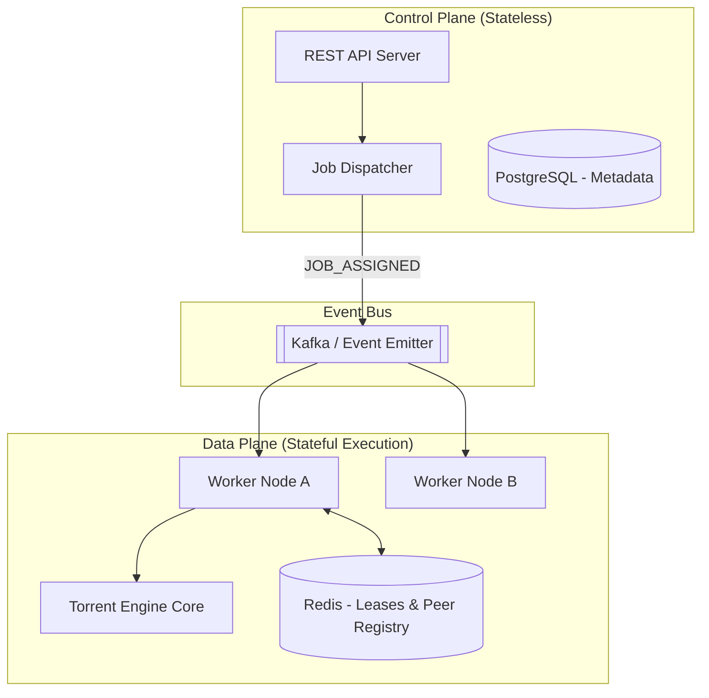

# 🏗️ TorrentEdge Architecture Deep-Dive

This document provides a comprehensive, technical breakdown of the TorrentEdge platform's architecture. It details how the system is structured to achieve high availability, scalability, and resilience when managing high-throughput distributed BitTorrent downloads.

---

## 1. Executive Summary

TorrentEdge is built as an **Event-Driven Distributed System** residing within a **Monorepo**. 
*   **Frontend**: A Vue/Vite-based Single Page Application (SPA) providing a modern dashboard. https://github.com/techmedaddy/torrentedge-UI
*   **Backend**: A Node.js ecosystem utilizing PostgreSQL, Redis, and Kafka (or an internal event bus).

The defining architectural characteristic of TorrentEdge is the strict separation between the **Control Plane** (managing state, users, and orchestrating work) and the **Data Plane** (executing heavy I/O workloads).

---

## 2. Core Architectural Pattern: Control Plane vs. Data Plane

To ensure that heavy network traffic and disk I/O do not bottleneck API responsiveness, TorrentEdge separates concerns into two distinct areas:

### The Control Plane
*   **Responsibilities**: Authentication, routing, persisting metadata to PostgreSQL, and orchestrating transfers.
*   **The Dispatcher**: When a user adds a magnet link, the API does not start the download. Instead, it saves the transfer intent to the database and passes it to the `Dispatcher`. The Dispatcher packages this as a standardized `JobDirective` (e.g., `JOB_ASSIGNED`) and publishes it to the event bus.

### The Data Plane
*   **Responsibilities**: Speaking the BitTorrent wire protocol, managing DHT nodes, writing chunks to disk, verifying SHA-256 hashes, and deduplicating data.
*   **The WorkerConsumer**: Background processes (workers) listen to the event bus. When a `JOB_ASSIGNED` event arrives, a worker picks it up and hands it to the internal `TorrentEngine` to execute the heavy lifting.

---

## 3. Distributed Resilience Mechanisms

To function safely in a multi-node environment (like Kubernetes), TorrentEdge implements several advanced distributed systems patterns.

### 3.1 Distributed Leasing (Preventing Split-Brain)
If multiple workers receive the same resume command, they could corrupt the downloaded files by writing to the same disk location simultaneously. 

*   **Mechanism**: Before a worker starts a download, it must acquire a **Cryptographic Lease** via Redis using atomic Lua scripts (`leaseManager.js`).
*   **Heartbeats**: Workers emit a heartbeat every 10 seconds. During this heartbeat, they renew their leases for all active torrents. If a worker crashes, its leases expire automatically after 30 seconds, allowing another worker to safely resume the job.

### 3.2 Idempotency & Fault Tolerance
*   **X-Request-ID**: Every incoming API request gets a unique trace ID.
*   **IdempotencyGuard**: Prevents duplicate execution. If a user clicks "Pause" 5 times in a panic, the system only processes the first command and returns cached results for the rest.
*   **CAS Checkpointer**: Chunk verification results are persisted to Postgres. If a node dies at 99%, the next node to acquire the lease only verifies the hashes, sees 99% complete, and downloads only the missing 1%.

---

## 4. Storage & Efficiency Layer

### 4.1 Content-Addressable Storage (CAS) Deduplication
TorrentEdge eliminates redundant storage across different torrents that share the same files (or parts of files).
*   **The CAS Store**: When a piece is verified, its data is stored in a hidden `.torrentedge/cas/` directory, named strictly by its SHA-256 hash.
*   **Pre-population**: When a new transfer starts, the `DeduplicationService` scans the expected hashes. If it finds a match in the CAS store, it immediately writes that data to the new torrent's file and marks the piece as complete—skipping the network download entirely.

### 4.2 Peer-Assisted Replication (VPC Local Peering)
If multiple users request the same torrent, and the data isn't perfectly deduplicated yet, nodes prioritize downloading from *each other* rather than the public internet to save on Egress costs.
*   **Peer Registry**: Workers register the `infoHashes` they are currently holding in Redis.
*   **Internal Discovery**: When a node starts a transfer, it queries Redis for sibling nodes holding the same data. It injects these sibling nodes into the `PeerManager` with **High Priority**, ensuring AWS VPC traffic is favored over external public trackers.

---

## 5. Observability (SRE Pillar)

You cannot manage what you cannot measure. TorrentEdge exposes deep insights into its distributed state:

1.  **Prometheus Metrics**: Exposes `/metrics` containing HTTP latencies, queue depths, Kafka message throughput, dedup hit rates, and VPC peer counts.
2.  **OpenTelemetry (OTel)**: Distributed tracing allows a developer to trace a request from the moment the user clicks "Start" on the Vue dashboard, through the Express API, across the Kafka topic, and down into the Worker node executing the command.
3.  **Kubernetes Probes**: Granular `/api/health` (liveness) and `/api/ready` (readiness) endpoints ensure traffic is only routed to healthy nodes connected to all backing services (Postgres, Redis, Kafka).

---

## 6. Summary of Technologies

| Layer | Technology | Purpose |
| :--- | :--- | :--- |
| **Frontend** | Vue 3 + Vite | Reactive, modern user interface. |
| **API Framework** | Express.js (Node.js) | High-throughput non-blocking I/O web server. |
| **Relational Data** | PostgreSQL + Sequelize | ACID-compliant storage for users, nodes, transfers, and chunk hashes. |
| **Ephemeral Data** | Redis + ioredis | Sub-millisecond distributed locks, peer registries, and rate limiting. |
| **Event Bus** | Apache Kafka (or EventEmitter) | Decoupling the API from the heavy torrent workers. |
| **Observability** | Prometheus, Grafana, Tempo | Metrics, dashboards, and distributed tracing. |
