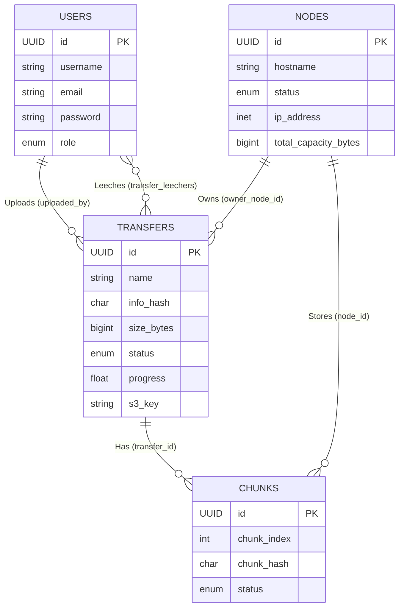

# TorrentEdge Database Design

The TorrentEdge application uses a relational database (PostgreSQL/MySQL) managed via Sequelize ORM. The schema is designed to track users, physical edge nodes in the network, torrent transfers, and the individual chunks of those transfers.

Here is a detailed breakdown of the current database design and the data we are storing.

## 1. Tables and Data Models

### `users`
Stores information about the people using the TorrentEdge platform.
- **id**: UUID (Primary Key)
- **username**: String(30), unique, required.
- **email**: String, unique, required (validated as an email).
- **password**: String, nullable (to support OAuth users).
- **role**: ENUM (`'user'`, `'admin'`), defaults to `'user'`.
- **google_id**: String, unique (for Google OAuth).
- **avatar**: String (URL to avatar image).
- **auth_provider**: ENUM (`'local'`, `'google'`), defaults to `'local'`.
*Data purpose: Authentication, authorization, and ownership of transfers.*

### `nodes`
Represents the edge computing nodes (or storage nodes) in the TorrentEdge decentralized network.
- **id**: UUID (Primary Key)
- **hostname**: String, required.
- **status**: ENUM (`'online'`, `'offline'`, `'maintenance'`), defaults to `'online'`.
- **ip_address**: INET (IP Address).
- **total_capacity_bytes**: BigInt, total storage capacity.
- **available_capacity_bytes**: BigInt, current available storage capacity.
- **last_heartbeat_at**: DateTime (Used to track if the node is still alive).
*Data purpose: Tracking network infrastructure, capacity planning, and routing chunks/transfers to healthy nodes.*

### `transfers`
Represents a torrent or file transfer within the system.
- **id**: UUID (Primary Key)
- **name**: String, required.
- **info_hash**: CHAR(40), unique, required (The torrent's unique hash).
- **magnet_uri**: Text, nullable.
- **size_bytes**: BigInt, required (Total size of the transfer).
- **status**: ENUM representing various states like `'created'`, `'queued'`, `'in_progress'`, `'paused'`, `'completed'`, `'failed'`, `'downloading'`, `'seeding'`, `'pending'`, `'fetching_metadata'`, `'idle'`, `'checking'`, `'error'`.
- **priority**: Integer, defaults to 10.
- **lease_expires_at**: DateTime, nullable.
- **progress**: Float, defaults to 0 (Percentage of completion).
- **source_path**: String, nullable.
- **torrent_file_path**: String, nullable.
- **created_from_upload**: Boolean, defaults to false.
- **s3_key**: String, nullable (Used for S3 Cold Start Bridge - Phase 4).
*Data purpose: Tracking the lifecycle, metadata, and location of torrents/files being transferred across the network.*

### `chunks`
Represents the individual pieces (chunks) of a transfer.
- **id**: UUID (Primary Key)
- **chunk_index**: Integer, required (The position of the chunk in the file).
- **chunk_hash**: CHAR(64), nullable (Cryptographic hash to verify chunk integrity).
- **status**: ENUM (`'pending'`, `'downloading'`, `'verified'`, `'failed'`).
- **verified_at**: DateTime, nullable.
- *Indexes*: Unique composite index on `(transfer_id, chunk_index)`.
*Data purpose: Granular tracking of file pieces, allowing distributed storage and piecemeal downloading/verification.*

### `transfer_leechers` (Join Table)
A many-to-many relationship table connecting `users` and `transfers`.
- **user_id**: UUID (Foreign Key to `users`)
- **transfer_id**: UUID (Foreign Key to `transfers`)
*Data purpose: Tracks which users are currently leeching (downloading) which transfers.*

---

## 2. Relationships (Associations)

The relational design connects these entities as follows:

1. **User ↔ Transfer (Uploads)**
   - A `User` has many `Transfers` (foreign key: `uploaded_by`).
   - A `Transfer` belongs to one `User` (the uploader).
   
2. **User ↔ Transfer (Leechers)**
   - A `User` belongs to many `Transfers` (through the `transfer_leechers` table).
   - A `Transfer` belongs to many `Users` (the leechers).

3. **Node ↔ Transfer (Ownership)**
   - A `Node` has many `Transfers` (foreign key: `owner_node_id`).
   - A `Transfer` belongs to one `Node` (the owner node).

4. **Transfer ↔ Chunk**
   - A `Transfer` has many `Chunks` (foreign key: `transfer_id`).
   - A `Chunk` belongs to one `Transfer`.

5. **Node ↔ Chunk (Storage)**
   - A `Node` has many `Chunks` (foreign key: `node_id`).
   - A `Chunk` belongs to one `Node` (indicating which node physically stores this chunk).

---

## 3. Visual Representation

